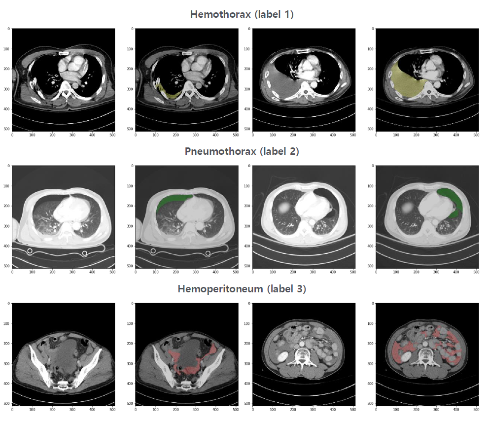
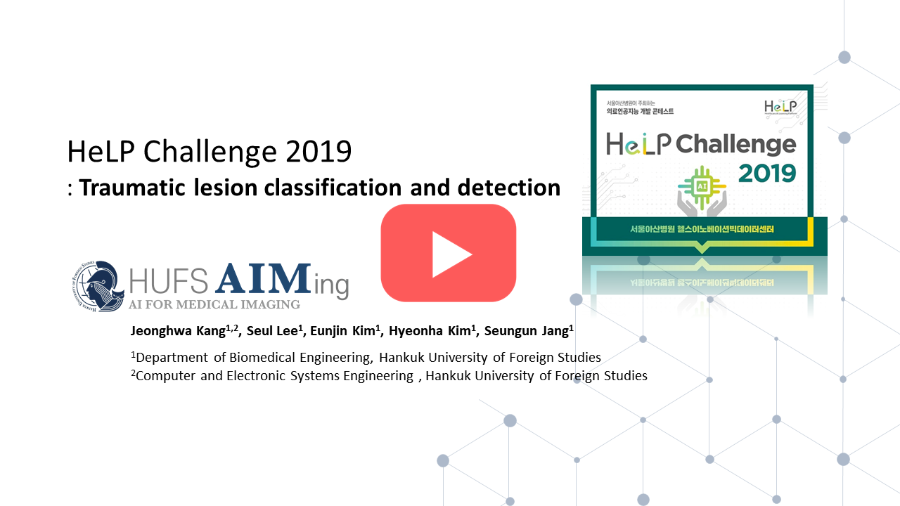

<h1 align="center">
    <p>HeLP Challenge 2019</p>
</h1>

This work is 1st place solution to [HeLP Challenge 2019 in Traumatic lesion classification and detection category](https://www.synapse.org/#!Synapse:syn21034537/wiki/)  organized by Asan Medical Center.


Team Members:  
**Junghwa Kang, Seul Lee, Eunjin Kim, Hyeonha Kim, Seungun Jang**

## Obejective

'Golden hour' is a term commonly used in trauma, which indicates that an injured patient has 60 minutes from time of injury to receive definitive care, after which morbidity and mortality significantly increase.  The shorter the time, the higher the chance of survival. Computed tomography (CT) is essential for the evaluation, diagnosis, and treatment planning; however, trauma patients often present with multiple injuries, requiring a whole body scan, which can take time to acquire and analyze whole body images. In terms of the golden hour, **automatic classification and detection of traumatic lesions using deep learning model** can provide emergency/trauma physicians and surgeons with diagnoses in the shortest possible time.

## Tasks

Analyze the whole-body trauma CT scans with and without three major traumatic findings  
– **Hemothorax, Pneumothorax, and Hemoperitoneum.**

1. Classification of patients with or without lesions for each of the traumatic lesions.
2. Classification of slices with or without lesions for each of the traumatic lesions.
3. Detection of each of the three major traumatic lesions.

## Data description
- whole-body trauma CT scans
- label 1 for Hemothorax, 2 for Pneumothorax, 3 for Hemoperitoneum, 0 for background  

According to the challenge rules, all code execution was performed on a cloud based system.

<details>
<summary>Data structure</summary>
<p>


    ```bash
    data
    ├── train
    │     ├──img
    │     │   ├── WBCT_0001.img
    │     │   ├── WBCT_0002.img
    │     │   └── ...
    │     └──groundtruth
    │         ├── WBCT_0001.img
    │         ├── WBCT_0002.img
    │         └── ...
    ├── test
    │     ├── WBCT_0453.img
    │     ├── WBCT_0454.img
    │     └── ...
    ├── output
    └── volume
    ```
</p>
</details>

<div align="center">
  
</div>

## Methods

- **Pre-processing**

    - Remove CT plate
    - Intensity normalization using CT windowing
    - Use random data augmentation to handle data imbalance


- **Deep learning model**
    -  U-net with a pre-trained Resnet34 as encoder
        - optimization method: Adam
        - batch size: 8
        - Learning rate:1e-5 ~ 1e-4, 1e-4/400 ~ 1e-4/4
        - epochs: 10
        - loss function: Weighted Cross entropy

    - model ensemble  

<div align="center">
  <a href="https://www.youtube.com/watch?v=v1XVpkY08gc"></a>
</div>

If you would like to know more about our method, you can watch this presentation.

## Results

1st place in both phase 1 and 2

<div>

| Phase 1  | Phase 2 |
| :-------: | :-------: | 
| 0.8296 | 0.8604 |

</div>

## Dependencies
- fastai==1.0.60
- nibabel==3.2.1
- nilearn==0.8.1
- opencv-python==4.5.4.58
- scikit-image==0.17.2 
- CUDA 10.0
- cuDNN 7.3.0+

## Getting started

### Installation

1. **Using local environment:** 
    ```bash
    
    # Setup virtual environment using conda or something else
    conda create -n hc 
    conda activate hc

    # Clone repository
    git clone https://github.com/HUFS-AIMLAB/HeLP-Challenge-2019.git
    cd HeLP-Challenge-2019/src
    pip install -r requirements.txt

    ```
2. **Using docker:**  

    build docker image
    ```bash
    
    # Clone repository
    git clone https://github.com/HUFS-AIMLAB/HeLP-Challenge-2019.git
    cd HeLP-Challenge-2019/submit_format
    ./build-1.2-cuda10.0-cudnn7-runtime.sh

    ```
    
    or you can pull docker image from Docker Hub.
    
    ```bash
    docker pull bugpigg/hufsaim-help-challenge-2019:latest
    ```
### Execution

1. **Preprocessing ** 
        `python ./src/preprocessing.py`

2. **Train**  
        `python ./src/train.py`

3. **Inference** 
        `python ./src/inference.py`

## Lincense

This repository is licensed under the MIT License.

## Acknoweldgment

This repository referenced from [fastai's tutorial notebook](https://github.com/fastai/course-v3/blob/master/nbs/dl1/lesson3-camvid.ipynb) template.
